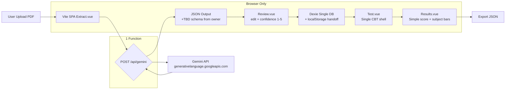

# Rankify-PDF2CBT — Light Wrapper Rebuild Plan

> **Source:** Rebuild from `C:/Projects/Rankify-V1` (private) base `https://github.com/TheMoonVyy/pdf2cbt` + jugaad AI pipelines.  
> **New Repo:** `C:/Projects/Rankify-PDF2CBT` → Open Source, light, no clutter.  
> **Status:** Planning phase — base JSON from `C:/Projects/Rankify-V1/CLAUDE.md:241` integrated (PartialQuestion + vocab + content standard), awaiting owner better system to finalize `AGENT.md:425` diff.  
> **Stack Choice:** VoidZero (`voidzero.dev`) — Vite 7 + Rolldown + Vitest + Oxc  
> **Modes:** AI Only Light (single Gemini proxy), Simple Analytics  
> **Key Input:** `AGENT.md` (1208 lines) — deterministic pipeline, extraction pipeline `AGENT.md:98`, tools `AGENT.md:134`, frontend suite `AGENT.md:226`

---

## 1. Executive Summary

### Problem with Rankify-V1
- Started as `pdf2cbt` manual cropper, then stacked 4 free-AI providers (Gemini, Groq, NVIDIA, Cerebras/Mistral OCR) with chunking, base64, file-size heuristics `apps/shared/app/utils/geminiAPIClient.ts:301`, `mistralPipelineAPIClient.ts:413`.
- Result: 273 Vue SFC, 61 utils, 33 composables, 3 IndexedDBs `db/index.ts:43`, duplicate CBT shells `cbt/interface.vue:1` vs `cbt/test.vue:1`, MuPDF WASM worker `mupdf.worker.ts:1`, heavy anim deps `gsap 3.13 + lenis 1.3.14 + ogl 1.0.11 + echarts 6.0`.
- Final working path degraded to `ishortn.ink/gemini-gem` paste-JSON + re-upload PDF for diagram crop — not maintainable.
- Only defensible asset: `apps/shared/app/pages/index.vue:1` homepage (hero/scanner/evervault/bento/infinite-menu) — won hackathons on idea+UI.

### Goal for Rankify-PDF2CBT
Build a **working, very light, optimized wrapper** that does **one thing well**: `PDF → AI extract (Gemini only) → Review → CBT → Simple Results`. No manual cropper, no multi-provider fallback, no heavy analytics. Keep homepage, make rest dead-simple. Prepare for open-source.

### Non-Goals (Explicitly OUT)
- Manual `pdf-cropper.vue:1` box/line crop, MuPDF WASM, `vue-advanced-cropper`
- Multi-provider orchestration (`groqAPIClient.ts`, `nvidiaAPIClient.ts`, `mistralPipelineAPIClient.ts`, `cerebras`)
- Offline ZIP `fflate 0.8.2`, `pdf2cbt-2.1.0` static export, `unstorage`
- Duplicate CBT themes, `echarts`, time-analysis 30-min buckets `cbt/results.vue:1024`, diagram coordinate detection `diagramDetection.js:23KB`
- Lenis smooth scroll + full GSAP suite (MorphSVG, Flip, SplitText, Scramble) — keep only if homepage needs it

---

## 2. Tech Stack — VoidZero Light

| Layer | Choice | Why | Rankify-V1 Equivalent |
|-------|--------|-----|----------------------|
| Bundler | **Vite 7 + Rolldown** (`rolldown-vite`) | VoidZero, 10x faster than Vite 6, Rust-based | `Vite 6` in `apps/web/nuxt.config.ts:77` |
| Framework | **Vue 3.5 + Vue Router 4** | Keep homepage Vue SFC, no Nuxt layers | `Nuxt 4.2.0` `apps/shared/nuxt.config.ts:1` |
| Language | **TypeScript 5.9** + `oxc`/`oxlint` | VoidZero toolchain, drop ESLint 9 | `typescript 5.9` + `eslint 9.39` |
| Styling | **Tailwind CSS 4.1.16** + `@tailwindcss/vite` | Reuse `main.css`, `critical.css` | Same |
| UI Primitives | **reka-ui 2.6.0** + `shadcn-vue` + `lucide-vue-next 0.552` | Keep `components/ui/*` (~27) but trim to ~12 needed | Same |
| Head/Meta | `@vueuse/head` | Replace `useHead` in `index.vue:554` (SEO JSON-LD) | `nuxt app.head` |
| State | **Vue `ref/reactive` + `useState` minimal** + `localStorage` | No `CbtUseState` 14-key sprawl `shared/enums.ts:1` | `useCbtTestData.ts:62` |
| Persistence | **Dexie 4.2.1 — Single DB** `RankifyPDF2CBT` | 1 DB 3 tables, not 3 DBs `aiStorageUtils.ts:59` + `diagramStorage.ts:20` | `RankifyDB('CBT-Interface')` 8 tables |
| PDF | **pdfjs-dist 5.4.296** only (canvas render for preview) | Drop `mupdf 1.26.4` WASM 1yr cache `shared/nuxt.config.ts:86` | Both |
| AI | **Single Gemini proxy** `POST /api/gemini` | Fix key leak `geminiAPIClient.ts:158` direct `?key=` | 6 Nitro proxies `apps/web/server/api/**` |
| Test | **Vitest 4.0.7 + jsdom + @vue/test-utils** | VoidZero, keep `vitest.config.ts:1` | Same |
| Deploy | **Vercel** (Vite SPA + 1 serverless fn) or Cloudflare Workers | Keep `vercel.json:1` headers/CSP but simplified | Same |
| Analytics | `posthog-js` optional, light | Keep `posthog.client.ts:1` if needed | Same |

**Bundle Target:** < 350KB initial JS (vs ~1.2MB now with `manualChunks` vendor-vue/ui/charts/motion `apps/web/nuxt.config.ts:90`). Remove `ogl`, `gl-matrix`, `echarts`; keep `katex 0.16.11` for math `AGENT.md:363` + `UiMathText.vue` required for `text` rendering.

**AGENT.md Integration Note:** `AGENT.md:4` pipeline is agent-agnostic — YOU are orchestrator, scripts handle deterministic ops `AGENT.md:20` (checksums `AGENT.md:1169`, IDs `AGENT.md:1165`, normalization `AGENT.md:1155`, topic map `AGENT.md:1161`, validation 33 checks `AGENT.md:1173`). Light wrapper keeps this philosophy: `useExtract.ts` only does Gemini call + `PartialQuestion` extraction; `src/lib/normalize.ts` + `src/lib/validate.ts` handle deterministic post-processing. Do NOT compute checksums/IDs in Gemini path.

---

## 3. Architecture

### 3.1 High-Level



### 3.2 Request Lifecycle

```
Home.vue (/) -> Extract.vue (/extract) -> fetch /api/gemini (hide key) -> Review.vue (/review) -> Test.vue (/test) -> Results.vue (/results)
No middleware ai-features.ts:8, no routeRules CDN cache complexity web/nuxt.config.ts:16, single vue-router guard.
```

### 3.3 Comparison to Rankify-V1

| Concern | V1 | V2 Light |
|---------|----|----------|
| Layers | `shared` layer + `web` app `extends:['../shared']` | Single `src/` |
| PDF ingestion | AI pipeline + Manual pipeline `DUAL_PIPELINE_ARCHITECTURE.md` | AI only |
| AI providers | Gemini direct + Groq/NVIDIA/Mistral/Cerebras proxies | 1 Gemini proxy |
| Workers | MuPDF Comlink + pdfjs worker per batch `groqAPIClient.ts:523` | pdfjs only, no worker |
| Storage | 3 DBs + 14 localStorage keys `CbtUseState` | 1 DB 3 tables + 3 keys |
| CBT | 2 shells 1288 vs 956 LOC | 1 shell ~400 LOC |
| Results | ChartsPanel echarts + TimeAnalysis | Simple bars + table |
| Homepage | Full GSAP suite + Lenis + InfiniteMenu + Evervault | Keep but simplified (GSAP core + CSS) |

---

## 4. Folder Structure (Proposed)

```
C:/Projects/Rankify-PDF2CBT/
├── PLAN.md (this file)
├── README.md (open-source, light)
├── index.html
├── vite.config.ts          # rolldown-vite + @tailwindcss/vite + alias
├── tsconfig.json           # no project references, single
├── package.json            # type:module, scripts: dev/build/preview/test
├── public/
│   ├── favicon*, og-image.png (from apps/shared/public/og-image.png)
│   ├── fonts/ (10 fonts from shared/public/fonts) or cdn
│   └── robots.txt, site.webmanifest
├── api/
│   └── gemini.post.ts      # Vercel serverless — single proxy (Node)
├── src/
│   ├── main.ts            # createApp + router + head
│   ├── App.vue            # <RouterView> + Toaster (vue-sonner 2.0)
│   ├── router/index.ts    # 5 routes, guard for /review|/test data check
│   ├── vocabulary.ts      # PORT from AGENT.md:425 src/vocabulary.ts — subjectTags + topicAliases + topicToChapter
│   ├── assets/css/main.css # from apps/web/app/assets/css/main.css + critical
│   ├── components/
│   │   ├── layout/Navbar.vue       # from MainNavBar.vue simplified
│   │   ├── home/ Hero.vue, Scanner.vue, Pipeline.vue, Features.vue, FAQ.vue, Footer.vue
│   │   ├── extract/ UploadZone.vue, Progress.vue, ApiKeyInput.vue
│   │   ├── review/ QuestionCard.vue (from Docs/ReviewInterface/QuestionCard.vue:1), ValidationPanel.vue lite
│   │   ├── cbt/ QuestionPanel.vue, Palette.vue, Timer.vue, SubmitDialog.vue
│   │   ├── results/ ScoreCard.vue, SubjectBars.vue (no echarts)
│   │   └── ui/ button.vue, card.vue, dialog.vue, input.vue ... (12 only)
│   ├── composables/
│   │   ├── useExtract.ts     # orchestrator only — reads Gemini markdown, outputs PartialQuestion[] AGENT.md:20, no checksums
│   │   ├── useCBT.ts         # merges useCbt* (timer, logger, settings)
│   │   ├── useReview.ts      # replaces useReviewInterface.ts:44
│   │   └── useTheme.ts       # from theme.client.ts
│   ├── lib/
│   │   ├── db.ts             # Single Dexie DB (see §6)
│   │   ├── gemini.ts         # fetch /api/gemini, no direct ?key=
│   │   ├── pdf.ts            # pdfjs preview + getPageAsImage
│   │   ├── normalize.ts      # PORT normalizeLatex AGENT.md:440 — whitespace/math-aware, options single-line
│   │   ├── vocabulary.ts     # re-export + normalizeTopic() AGENT.md:63
│   │   ├── validate.ts       # 33 checks-lite from auto-validator.ts AGENT.md:1173 — count/subject/answer/diagram/order
│   │   ├── utils.ts          # cn() from lib/utils.ts:1
│   │   └── constants.ts      # exam defaults AGENT.md:429 + SEPARATOR retired
│   ├── types/
│   │   ├── index.d.ts        # PartialQuestion + ExtractCache AGENT.md:245 — canonical, owner will refine
│   │   └── cbt.d.ts          # TestSession, QuestionStatus, Results
│   └── pages/
│       ├── Home.vue          # port index.vue:1 (530 lines → ~350 after trim)
│       ├── Extract.vue       # new, replaces ai-extractor.vue:1
│       ├── Review.vue        # port review-interface.vue:8 simplified
│       ├── Test.vue          # single CBT, merge cbt/test.vue + interface.vue
│       └── Results.vue       # port cbt/results.vue:1 simplified
└── tests/
    └── extract.test.ts, cbt.test.ts
```

---

## 5. Pages & User Flows (Light)

### 5.1 Home `/` — KEEP & TRIM `apps/shared/app/pages/index.vue:1`
- **Keep:** Hero `79`, Scanner `137`, Pipeline Evervault `243`, Bento `321`, UseCases InfiniteMenu `392`, FAQ `443`, Footer `468` + SEO `useHead:554` (JSON-LD SoftwareApplication + FAQPage).
- **Trim:** Remove `Lenis` scroll `lenis.client.ts:1`, keep CSS scroll; reduce GSAP from 7 plugins `index.vue:536` (`ScrollTrigger, TextPlugin, SplitText, Scramble, MorphSVG, Flip`) to `gsap + ScrollTrigger` only; remove `UnicornStudio` WebGL `footerBg`; remove `InfiniteMenu` progressive blur heavy DOM `408`; keep `CircularText.vue`, `EvervaultScanner.vue` but lazy-load.
- **CTA:** `Start Extraction` -> `/extract` (was `/ai-extractor`).

### 5.2 Extract `/extract` — NEW LIGHT (CORRECTED: GEM Paste Primary, AI Fallback)
**User correction:** NOT direct Gemini API. Primary = **Gemini GEM preset chat** (`ishortn.ink/gemini-gem`) → user gets JSON from chat → **Paste JSON here for parsing** `ai-extractor.vue:558` paste dialog. This is the working jugaad that actually works.

- **Primary Flow (80% cases):**
  1. User opens GEM link (preset instructions) in new tab, uploads PDF to Gemini chat, copies JSON output
  2. Back in `/extract`: Drag PDF (for diagram crop later, <20MB) + **Paste JSON** textarea (validates against `UniversalPaper` schema `src/types/schema.json:1`) + optional `Paste JSON URL` fetch
  3. `src/lib/parse.ts` validates via `validatePaper` `src/lib/validate.ts:1` + `normalize.ts` `AGENT.md:440` → `localStorage rpdf2cbt-review` → `/review`
  4. No API key needed, no 413, no fileSize heuristic `geminiAPIClient.ts:301`

- **Fallback AI (20% — less questions PDFs):** Keep **1-2 light providers only** (e.g. Gemini proxy `/api/gemini` + Groq as backup) behind `Fallback for small PDFs (<10 Q)` button. Not main flow. Hide by default, as user said "AI USAGE MEIN SIRF KUCH PROVIDER RAKH, fallback system".

- **Inputs:** PDF + Paste JSON (+ fallback API key if using fallback). No BYOK wall for primary.
- **Progress:** Simple `Parsing... → Validating → Ready` — no SparkProgressbar streaming, no `aiExtractionUtils.ts:163` diagram detection.
- **Output:** `UniversalQuestion[]` generic (subject/topic free) → `normalizeOptions` single-line `AGENT.md:442` → `validatePaper` → review. On fail show line/col JSON error, not `_extraction-report.md` heavy.

### 5.3 Review `/review` — MANUAL DIAGRAM CROP PER QUESTION (as current system has)
- **Load:** `history.state` `234` > `localStorage rpdf2cbt-review` > toast error (no mock `104`).
- **Features:** List `questions`+`originalQuestions`+`changedQuestions Set`, filter, **edit que/options/type inline**, delete/add. **PLUS per-question Manual Crop:** User uploads PDF once in `/extract`, PDF rendered via `pdfjs-dist` `src/lib/pdf.ts`; in Review each `QuestionCard.vue` has `Crop Diagram` button → opens `SimpleDiagramCropper.vue`-lite (pdf page canvas + crop rect) → saves `diagrams: [objectURL]` per Q to Dexie. This is existing working manual flow — keep it.
- **Validation live:** `validate.ts` light + diagram badge `hasDiagram` (true if cropped) — show if missing crop.
- **Save:** `normalize.ts` `AGENT.md:440` on `text/options` before `db` + `localStorage rpdf2cbt-current` → `/test`. No triple DB — single `RankifyPDF2CBT` DB `src/lib/db.ts:1`.

### 5.4 Test `/test` — SINGLE SHELL (merge `cbt/test.vue:1` + `interface.vue:973`)
- **Config:** `useCBT.ts` from `useCbtSettings.ts:27` defaults: duration 3h `defaultTestSettings:167`, marks +4/-1, sections from JSON.
- **Engine:** `QuestionPanel.vue` render via `UiMathText.vue` KaTeX (if needed) or plain text; `Palette.vue` 5 statuses `answered|notAnswered|notVisited|marked|markedAnswered` `pageCssVars:590`; `Timer.vue` `useCbtCountdownTimer.ts:1`; autosave `updateQuestionData:252` + `updateCurrentTestState:270` to Dexie.
- **Guards:** `beforeunload` + `router.beforeEach` `1051`, `toggleFullscreen`.
- **Submit:** `generateTestOutputData:1166` lite -> `db.put` + `navigateTo('/results')`. No `testOutputDatas: 'id++'` heavy `60`, no `testLogs` `addLog:150`.

### 5.5 Results `/results` — SIMPLE `cbt/results.vue:1`
- **Load:** `db.getTestResultOverview` + `localStorage rankify-test-results` `1418`.
- **Compute:** `generateTestResults:1250` + `getSumOfScoreCardData:1206` but no `optionalQuestions` sorting `1332`, no `TimeAnalysis:1024` 30-min intervals.
- **UI:** `ScoreCard.vue` (total, attempted, correct), `SubjectBars.vue` (CSS flex bars, not `ChartsPanel.vue` echarts), `DetailedPanel.vue` per question with `ResultStatus`. No `ChartsPanel`, `ProgressOverview:866`, `TimeAnalysis`.

---

## 6. Data & Storage Design

### 6.1 Dexie Single DB `src/lib/db.ts`

```ts
// Replaces 3 DBs: RankifyDB('CBT-Interface') 8 tables + RankifyAI + RankifyDiagramDB
export class RankifyPDF2CBT extends Dexie {
  currentTest!: Table<CurrentTest, 'id'> // id=1 only
  results!: Table<Result, 'id'> // id auto
  settings!: Table<Settings, 'id'> // id=1 theme/apiKeyRef
}
interface CurrentTest { id: string; json: JsonOutput; state: CbtState; updatedAt: number }
interface Result { id?: number; json: JsonOutput; score: Score; createdAt: number }
interface Settings { id: string; theme: 'light'|'dark'; lastExtractAt?: number }
```

**Tables:** 3 vs 8. No `testLog`, `testQuestionsData` Map, `testNotes`, `testOutputDatas`, etc.

**localStorage keys (3 only):**
- `rpdf2cbt-review` (handoff extract→review)
- `rpdf2cbt-current` (review→test)
- `rpdf2cbt-theme` (from `LocalStorageKeys.AppThemeVariant`)

Replaces `CbtUseState` 14 keys `shared/enums.ts:1` + `rankify-*` 6 keys.

### 6.2 JSON Output Schema — Integrated from `C:/Projects/Rankify-V1/CLAUDE.md:241`

Owner will provide final better system later, but `AGENT.md` already defines a battle-tested schema. **Use it as baseline for light wrapper** — do NOT reinvent. This powers Analysis Dashboard `CLAUDE.md:36` and deterministic pipeline `CLAUDE.md:98`.

#### A) PartialQuestion (Your Gemini Must Output) `AGENT.md:245`
```ts
interface PartialQuestion {
  number: number;              // 1-200
  numberLabel: string | null;  // "3a" or null
  subject: "physics" | "chemistry" | "biology" | "mathematics";
  topic: string | null;        // STRICT: only from controlled vocab §6.5, never invent. See AGENT.md:60
  chapter: string | null;      // NCERT chapter (e.g. "Current Electricity") — broader than topic, from topicToChapter in src/vocabulary.ts
  section: string | null;      // "a"/"b" or null
  type: "mcq" | "msq" | "nat" | "assertion-reason" | "match-list" | "matrix-match"; // AGENT.md:253
  text: string;                // LaTeX preserved ($…$, $$…$$) — never Unicode μ→$\mu$ AGENT.md:347
  textHi: string | null;       // Hindi if bilingual
  options: string[] | null;    // MCQ/MSQ 4 opts, NAT/AR null, match-list 4-8
  answer: string;              // MCQ/AR "1"-"4" (1-indexed as displayed), NAT "42"/"3.14", MSQ "" AGENT.md:397
  answers: string[] | null;    // MSQ only ["1","3"] 0-indexed sorted AGENT.md:998, else null
  answerPrecision: AnswerPrecision | null; // NAT only: {type:"exact"|"integer-range"|"decimal-range", min,max, alternates?}
  marks: number;               // usually 4 — HISTORICAL FACT, do NOT normalize AIEEE 2002 is +3/−1 AGENT.md:12
  negativeMarks: number;       // MCQ -1, NAT 0, JEE Adv varies
  partialMarking: PartialMarking | null; // MSQ JEE Adv partial
  passageId: string | null;
  solution: string | null;
  solutionFormat: "plain"|"html"|"markdown"|"latex"|null;
  hasDiagram: boolean;         // true if  in OCR markdown AGENT.md:334
  diagrams: null;              // Always null — script fills cacheDiagrams AGENT.md:1177
  difficulty: "easy"|"medium"|"hard"|null; // REQUIRED per exam calibration §6.5
  tags: string[];              // topic tags
  source: "official-pdf";      // always this
  confidence: null;            // always null for official
  answerMapping: Record<string,string>|null; // match-list/matrix-match
  bonus?: boolean;             // isBonus/cancelled
  _imageRefs?: string[];       // TEMP: ["img-001.jpg"] from full.md AGENT.md:274 — script resolves to diagrams/q{num}-fig{n}.ext
}
```

**Extract Cache Format** `AGENT.md:278`:
```json
{ "questions": [...PartialQuestion], "passages": [], "answerKeyFound": true, "expectedQuestions": 75 }
```

#### B) Enhanced Required Fields `AGENT.md:36` — Power Analysis Dashboard
Gemini prompt MUST request these 3 for every Q:
- `difficulty` per-exam calibration `AGENT.md:46`: NEET easy 35%/med 50%/hard 15%, JEE Main 25/50/25, JEE Adv 15/45/40
- `chapter` via `topicToChapter` in `src/vocabulary.ts`
- `topic` STRICT from controlled vocab — if no match, map to closest + log to `discovered-topics.json` `AGENT.md:72`

#### C) Light Wrapper Port — What's Needed vs Dropped
For `Rankify-PDF2CBT`, Gemini needs to output **subset** of PartialQuestion (keep `number, subject, topic, chapter, type, text, options, answer/answers, hasDiagram, difficulty, marks`). `solution`, `passageId`, `textHi` optional. On client, `_imageRefs` + `diagrams:null` flow kept — `pdf.ts` saves `diagrams/qNNN-figN.png` like `cacheDiagrams` `AGENT.md:1177`.

**Action:** Keep `src/types/index.d.ts` as full PartialQuestion; owner later refines (e.g., add `confidence 1-5` from V1 `geminiAPIClient.ts:47` if needed). Do NOT use V1's simplistic `JsonOutput` with `SEPARATOR='__--__'` `shared/constants.ts:70` — use AGENT.md's canonical `number` + `subject` model.

### 6.2b Content Standard — `normalizeLatex` `AGENT.md:440`
Universal rules enforced by `normalizeLatex()` `src/finalizers/normalizer.ts` — **apply in light wrapper Review save** (even without full pipeline):
1. No blank-line runs `\n{2,}`→`\n`, 2. Options strictly single-line `AGENT.md:442`, 3. Single `\n` preserved for Assertion-Reason/match-list `AGENT.md:450`, 4. Math `$…$`/`$$…$$`/`\(…\)`/`\begin{env}` preserved verbatim `AGENT.md:454`, 5. `textHi` plain text.
Provide `src/lib/normalize.ts` port for Review→CBT.

### 6.2c LaTeX / KaTeX Rules `AGENT.md:345`
KaTeX 0.16.11: `μ→$\mu$`, `≤→$\leq$`, `$\vec{m}$` not `\vecm`, `$\hat{i}$` not `\hati`, `$\mathrm{m}$` `AGENT.md:355`. Gemini prompt must enforce. Render via `katex.renderToString(m,{displayMode, throwOnError:false, strict:false})` `AGENT.md:368`. Test at katex.org.

### 6.2d Answer Indexing `AGENT.md:397`
PDF `(1)(2)(3)(4)` → JSON `"1"-"4"` 1-indexed for MCQ/AR, NAT numeric string, MSQ `answer:""` + `answers:["0","2"]` 0-indexed sorted.

### 6.2e Controlled Vocabulary `AGENT.md:409` → `src/vocabulary.ts`
Copy from AGENT.md: Physics 35 topics `units-and-dimensions`...`general-physics`, Chemistry 35 `mole-concept`...`general-chemistry`, Biology 25 `diversity-in-living-world`...`general-biology`, Mathematics 30 `sets`...`general-mathematics`. Add `topicAliases` + `discovered-topics.json` discovery `AGENT.md:72`. Prompt Gemini with this list; validator enforces.

### 6.2f Exam Defaults `AGENT.md:429` → `src/constants.ts`
| Exam | Subjects | Qs | Marks | Negative | Types |
| neet | physics,chemistry,biology | 200 | 4 | -1 NAT 0 | mcq,msq,nat,assertion-reason |
| jeemain | physics,chemistry,mathematics | 75 | 4 | -1 | mcq Sec-A, nat Sec-B |
| jeeadv | physics,chemistry,mathematics | ~54/paper | varies | -2 MCQ 0 NAT partial MSQ | mcq,msq,nat,match-list,matrix-match |

Use for `expectedQuestions` validation + `marks` note historical facts `AGENT.md:12`.

### 6.2g Diagram Handling `AGENT.md:948`
`hasDiagram:true` if `` near Q → strip from `text`, store `"img-001.jpg"` in `_imageRefs`, set `diagrams:null` — finalizer copies `images/img-001.jpg` → `diagrams/q003-fig1.jpg`. All diagrams flat `diagrams/` `AGENT.md:985`. Keep for light wrapper (pdfjs → blob URL).

### 6.3 API — Single Proxy `api/gemini.post.ts`

```ts
// Replaces 6 proxies apps/web/server/api/**
export default defineEventHandler(async (event) => {
  const { pdfBase64, prompt, model } = await readBody(event)
  const key = getHeader(event,'x-gemini-key') || process.env.GEMINI_API_KEY // fallback, not NUXT_PUBLIC
  if(!key) throw createError({statusCode:401})
  // No fileSize/0.075 heuristic geminiAPIClient.ts:301, just forward to generativelanguage
  const res = await fetch(`https://generativelanguage.googleapis.com/v1beta/models/${model}:generateContent?key=${key}`, { method:'POST', body: JSON.stringify({...}) })
  return res.json()
})
```

Fixes leak `geminiAPIClient.ts:158` `?key=` client-side, handles 413 via simple 20MB guard, no `pdf-lib` chunking `mupdf` etc.

---

## 7. Components Inventory (Trimmed) + Deterministic Scripts Lite

| Area | V1 Count | V2 Target | Notes |
|------|----------|-----------|-------|
| ui | 27 folders (~110 files) | 12 (button/card/dialog/input/label/select/tabs/textarea/badge/progress/skeleton/sonner/tooltip) | Keep `cn` `lib/utils.ts:1` |
| home | Evervault+InfiniteMenu+Spotlight | Keep but lazy | Remove `GlassSurface`, `ShaderBackground`, `PrismBg` etc unused |
| extract | AIExtractor.vue + GenerateAnswerKey etc | 3 (UploadZone, Progress, KeyInput) | Orchestrator only `AGENT.md:20` |
| review | QuestionCard + ValidationPanel + 6 Docs | 2 (QuestionCard, ReviewBar) + `pdf-reviewer.html:882` shortcuts | `hasDiagram` audit `AGENT.md:151` |
| cbt | 13 Interface + 11 Results | 4 (QuestionPanel, Palette, Timer, ResultsSimple) | |
| total Vue | 273 | ~35 | 87% reduction |

**Scripts to port lite from `AGENT.md:134`:**
- `normalizeLatex` `AGENT.md:440` → `src/lib/normalize.ts` (whitespace + math preserve + options single-line)
- `normalizeTopics` `AGENT.md:1161` → `src/lib/vocabulary.ts` `normalizeTopic()` + aliases + discovered-topics
- `validateQuestionFile` `AGENT.md:1173` 33 checks → `src/lib/validate.ts` lite (count/subject/answer/diagram/order)
- `cacheDiagrams` `AGENT.md:1177` → `src/lib/pdf.ts` `images/img-001.jpg` → `diagrams/q003-fig1.jpg`
- `computeChecksum` `AGENT.md:1169` SHA-256 optional for export — add `checksum` field `AGENT.md:468` if exporting JSON, else skip (no verify.ts gate `AGENT.md:150` needed in browser)
- Frontend tools `AGENT.md:226` (`dashboard.html`, `pdf-viewer.html`, `pdf-reviewer.html`) — keep as future `src/pages/Dashboard.vue` stretch, not v1

---

## 8. Build & Deploy

### Scripts `package.json`
```json
{
  "type":"module",
  "scripts": {
    "dev": "vite --port 3000",
    "build": "vite build",
    "preview": "vite preview",
    "test": "vitest --run",
    "test:ui": "vitest --ui",
    "lint": "oxlint src"
  }
}
```

### Vercel `vercel.json` — Simplified from `apps/web/vercel.json:66`
- Keep `Cache-Control immutable` for `/_assets`, `headers` `X-Frame-Options:DENY` etc, but remove `CSP default-src *` permissive `29` (was for pdfjs blob), use `script-src 'self'` + `worker-src blob:` only.
- `api/gemini.post.ts` as `functions` with `maxDuration: 30s`.

### Env
```
GEMINI_API_KEY=fallback (server only, not NUXT_PUBLIC)
VITE_POSTHOG_TOKEN=optional
```
No `NUXT_PUBLIC_FALLBACK_*` 5 keys `apps/web/nuxt.config.ts:66`, no `DISABLE_SEO_MODULES`.

---

## 9. What to Port vs Rewrite

| File V1 | Action V2 | Reason |
|---------|-----------|--------|
| `apps/shared/app/pages/index.vue:1` | **Port, trim** | Keep hackathon-winning UI |
| `apps/web/app/app.vue:1` | Rewrite `src/App.vue` | Remove GTM/Clarity/anti-theft `154` |
| `apps/shared/app/utils/geminiAPIClient.ts:1` | **Rewrite** `src/lib/gemini.ts` 80 lines | Remove File-API vs inline dual path, streaming, rate limits `104` |
| `apps/shared/app/composables/useAIExtraction.ts:33` | Rewrite `useExtract.ts` | Orchestrator only `AGENT.md:20`, simple fetch, no 4 providers |
| `apps/shared/db/index.ts:43` | Rewrite `src/lib/db.ts` | 8 tables → 3 |
| `apps/shared/app/components/Docs/ReviewInterface/QuestionCard.vue:1` | Port lite | Core edit UI + `AGENT.md:882` edit mode |
| `cbt/test.vue` + `interface.vue` | Merge rewrite `Test.vue` | Remove duplication |
| `cbt/results.vue:1` | Port lite `Results.vue` | Remove echarts/charts, keep `difficulty` analytics `AGENT.md:36` |
| `apps/shared/app/assets/css/*` | Port `main.css` | Keep Tailwind |
| `apps/web/server/api/**` 6 files | Replace 1 `api/gemini.post.ts` | Single provider |
| `db/migrations` v4/v5 `utilEnsureHashInHexColor`, `MigrateJsonData` | Drop | Fresh DB, no migration |
| `pdf-cropper.vue`, `mupdf.worker.ts`, `diagramDetection.js` | **Drop** | Manual pipeline out |
| `C:/Projects/Rankify-V1/AGENT.md:245` PartialQuestion | **Port** `src/types/index.d.ts` + `vocabulary.ts` | Canonical topics/difficulty/chapter `AGENT.md:36`, content standard `AGENT.md:440` |
| `C:/Projects/Rankify-V1/AGENT.md:134` scripts (normalizer, validator, diagram-cacher) | **Port lite** `lib/normalize.ts`, `validate.ts`, `pdf.ts` | Deterministic ops `AGENT.md:20`, keep logic, drop file-system |
| `src/vocabulary.ts` `AGENT.md:425` | **Copy** `src/vocabulary.ts` | Physics/Chem/Chem/Bio/Maths vocab 120+ topics |

---

## 10. Implementation Phases & Checkpoints

| Phase | Scope | Deliverable | Checkpoint |
|-------|-------|-------------|------------|
| **0 — Scaffolding** | `pnpm create vite` + rolldown-vite + tailwind 4 + reka-ui + vue-router + @vueuse/head + dexie + copy `vocabulary.ts` `AGENT.md:425` | Empty shell builds | `pnpm dev` 3000 OK, `build` < 200KB |
| **0b — Types & Libs** | Port `PartialQuestion` `AGENT.md:245`, `normalizeLatex` `AGENT.md:440` → `normalize.ts`, `validate 33` lite `AGENT.md:1173`, exam defaults `AGENT.md:429` | Types + deterministic libs ready | `oxlint` + `tsc --noEmit` pass |
| **1 — Home** | Port `index.vue` sections, trim GSAP, responsive | `/` looks like V1 but light | Lighthouse >90, no Lenis |
| **2 — Extract** | `Extract.vue` + `/api/gemini` proxy + `useExtract` orchestrator `AGENT.md:20` + vocab prompt + KaTeX rules `AGENT.md:347` | Upload PDF → `PartialQuestion[]` | 5MB PDF <15s, 413 handled, vocab enforced |
| **3 — JSON Hook** | Owner better JSON replaces placeholder — diff vs `AGENT.md:245`, update `vocabulary/discovered-topics.json` flow `AGENT.md:72` | Types solid | Owner approves schema |
| **4 — Review** | `Review.vue` + `useReview` + `normalize` pass + diagram `hasDiagram`/`_imageRefs` `AGENT.md:949` + live validation | Edit → `localStorage` → `/test` | Edit 50 Q, content standard pass |
| **5 — CBT** | `Test.vue` single shell + timer + palette 5 statuses `pageCssVars:590` + autosave | Full mock test flow | 75 Q test (jeemain default `AGENT.md:433`), no data loss |
| **6 — Results** | `Results.vue` simple bars + `difficulty` breakdown `AGENT.md:46` + export `paper.json` per `AGENT.md:125` | Score + subject/difficulty | No echarts, <50KB JS |
| **7 — Polish** | SEO `useHead` JSON-LD from `index.vue:874`, PWA `site.webmanifest`, tests + `standardize-content` dry-run `AGENT.md:145` | Ready | `vitest --run` + `oxlint` pass |
| **8 — Open Source** | README light (from `README.md:600` trimmed), LICENSE AGPL-3.0, `vercel.json`, release | Public repo | Tag v1.0.0 |

**Estimated LoC:** V1 ~45K → V2 ~6K (87% cut).

---

## 11. Risks & Mitigations

| Risk | Impact | Mitigation |
|------|--------|------------|
| Homepage GSAP heavy → jank on mobile | Bad first impression | Keep only `gsap` + `ScrollTrigger`, lazy-load Evervault/InfiniteMenu with `ClientOnly`, remove Lenis `lenis.client.ts:15` query `.overflow-auto` bug |
| Gemini quota / key leak | Same as V1 `geminiAPIClient.ts:158` | Proxy hides key, rate-limit in `api/gemini`, require BYOK after fallback exhausted |
| PDF large >20MB Vercel 4.5MB payload | 413 `mistralPipelineAPIClient.ts:413` | Client guard 20MB `ai-extractor.vue:112`, compress via `pdfjs` canvas 1.5x before base64 if needed |
| JSON schema change from owner | Rework types | Keep `types/index.d.ts` generic `JsonOutput = unknown` until provided |
| No tests for CBT timer | Time loss bug `useCbtSettings.ts:18` leak | Single `useCBT` with `onUnmounted` cleanup, Vitest for timer |
| SEO drop vs V1 `robots.txt`, `sitemap 7.4.7`, `og-image` | Traffic | Keep `public/robots.txt`, `site.webmanifest`, `@vueuse/head` JSON-LD, static `og-image.png` |

---

## 12. Open-Source Checklist (for Phase 8)

- [ ] `README.md` light (keep Quick Start 5 steps `README.md:104`, remove heavy GIFs `212284100` ) + `How It Works` mermaid `285`
- [ ] LICENSE AGPL-3.0-or-later (V1)
- [ ] `CONTRIBUTING.md`, `CODE_OF_CONDUCT.md`
- [ ] `.env.example` with `GEMINI_API_KEY=` only
- [ ] `.gitignore` (`.output`, `.vercel`, `node_modules`, `.env`)
- [ ] GitHub Actions: `pnpm i --frozen-lockfile` + `vite build` + `vitest`
- [ ] Keep `Rankify-V1` private as requested

---

## 13. Immediate Next Steps (AGENT.md Integrated, Awaiting Owner JSON Refinement)

1. **DONE:** Integrated `AGENT.md:241` `PartialQuestion`, vocab `AGENT.md:409`, exam defaults `AGENT.md:429`, content standard `AGENT.md:440`, LaTeX `AGENT.md:345`, difficulty `AGENT.md:46`, diagram `AGENT.md:948`, deterministic philosophy `AGENT.md:20` into §6.2. Owner better system will diff/override this baseline — keep `discovered-topics.json` `AGENT.md:72` flow for new topics.
2. Then run **Phase 0 + 0b** scaffolding in `C:/Projects/Rankify-PDF2CBT` (empty now): `pnpm create vite` + copy `vocabulary.ts` + port `normalize.ts`/`validate.ts`.
3. Confirm: keep `katex 0.16.11` `AGENT.md:363` for math? (adds ~150KB) but required for `text` LaTeX (`AGENT.md:347` `$\mu$` etc). Recommend keep lite for `UiMathText.vue`.
4. Confirm: deploy target `vercel` vs `cloudflare`? Plan assumes Vercel (existing `rankify.qzz.io`, `rankify-ai.vercel.app`). If Cloudflare, replace `api/gemini.post.ts` with Worker.

---

*Plan v2 — authored from thorough V1 scan (explore + general subagents) + `C:/Projects/Rankify-V1/AGENT.md:1` deterministic pipeline + user brief on `voidzero.dev`, `AI Only Light`, `Simple Analytics`. Ready for owner JSON diff.*
