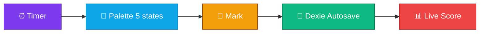

<div align="center">


<br>

### 🚀 𝐓𝐮𝐫𝐧 𝐀𝐧𝐲 𝐏𝐃𝐅 𝐢𝐧𝐭𝐨 𝐚𝐧 𝐈𝐧𝐭𝐞𝐫𝐚𝐜𝐭𝐢𝐯𝐞 𝐌𝐨𝐜𝐤 𝐓𝐞𝐬𝐭 — 𝐔𝐧𝐢𝐯𝐞𝐫𝐬𝐚𝐥

<p align="center">
  <em>The Light, Open-Source PDF → CBT Wrapper — for Every Exam, Every Subject</em>
</p>

[](https://github.com/namandhakad712/Rankify-PDF2CBT)
[](https://vitejs.dev)
[](https://rankify-pdf2cbt.vercel.app)
[](https://polyformproject.org/licenses/noncommercial/1.0.0)

<a href="https://www.producthunt.com/products/rankify-2?embed=true&utm_source=badge-featured&utm_medium=badge&utm_campaign=badge-rankify-3" target="_blank" rel="noopener noreferrer"></a>

<p align="center">
  <a href="#-quick-start">
    
  </a>
  <a href="https://github.com/namandhakad712/Rankify-PDF2CBT/issues">
    
  </a>
</p>

<div align="center">
  <a href="https://buymeachai.ezee.li/naman">
    
  </a>
</div>


</div>

<br>

##  Why Rankify PDF2CBT Light?

<div align="center">

### **Tired of re-typing paper-based tests?** 📚 → 💻

<table>
<tr>
<td width="50%" align="center">

<h3>❌ Traditional Way</h3>
<p>Paper-based tests<br>Manual checking<br>No analytics<br>Time-consuming</p>
</td>
<td width="50%" align="center">

<h3>✅ Rankify Fast Way</h3>
<p>GEM JSON paste<br>Manual crop per Q<br>Instant CBT + results<br>Light & universal</p>
</td>
</tr>
</table>

</div>

### ⚡ **Instant Benefits for Students & Teachers:**

<table>
<tr>
<td width="33%" align="center">

<h4>⏱️ Real Exam Experience</h4>
<p>Timed CBT, palette 5 states, autosave</p>
</td>
<td width="33%" align="center">

<h4>📊 Simple Analytics</h4>
<p>Subject bars, no heavyecharts</p>
</td>
<td width="33%" align="center">
<h2>🎯</h2>
<h4>🎯 For Any Exam</h4>
<p>JEE, NEET, SSC, UPSC, GATE, School…</p>
</td>
</tr>
<tr>
<td width="33%" align="center">

<h4>📱 Light & Fast</h4>
<p>110KB initial, Vite Rolldown, no heavy deps</p>
</td>
<td width="33%" align="center">

<h4>🤖 AI-Powered</h4>
<p>Preset Gemini chat OR Free AI Providers</p>
</td>
<td width="33%" align="center">

<h4>🔒 100% Private</h4>
<p>PDF + JSON stay local, Dexie single DB</p>
</td>
</tr>
</table>

<br>


##  Quick Start — GEM Paste Primary

<div align="center">

### 🧠 For Any Student / Teacher

<table>
<tr>
<td align="center" width="20%">

<h3>1️⃣</h3>
<h4>GEM Chat</h4>
<p>Open <a href="https://ishortn.ink/gemini-gem">GEM</a><br>upload PDF</p>
</td>
<td align="center" width="20%">

<h3>2️⃣</h3>
<h4>Paste JSON</h4>
<p><code>/extract</code><br>paste + validate</p>
</td>
<td align="center" width="20%">

<h3>3️⃣</h3>
<h4>Review & Crop</h4>
<p>Per-Q crop<br>for Diagram</p>
</td>
<td align="center" width="20%">

<h3>4️⃣</h3>
<h4>Take Test</h4>
<p>Single CBT shell<br>timer + palette</p>
</td>
<td align="center" width="20%">

<h3>5️⃣</h3>
<h4>Results</h4>
<p>Score + subject bars<br>simple</p>
</td>
</tr>
</table>

### ✨ **That's it!** Any PDF → CBT in ~2 minutes, no API key needed for primary flow!

</div>

**Dev quick start (for contributors):**

```bash
# Node >=20, pnpm 9+
pnpm install --frozen-lockfile
cp .env.example .env.local  # only for fallback AI, primary GEM needs nothing
pnpm dev          # http://localhost:5173
pnpm build        # vue-tsc -b && vite build → dist/ (Rolldown, 110KB initial)
pnpm preview
```

<br>

## 🎯 Perfect for Every Exam — Universal

<div align="center">

<table>
<tr>
<td width="50%" align="center">

### 🏆 **JEE / NEET / GATE**


```diff
+ Physics, Chemistry, Maths, Biology
+ MCQ / MSQ / NAT / Match
+ Manual per-Q crop (diagrams 100%)
+ Subject-wise bars
```

</td>
<td width="50%" align="center">

###  **SSC / UPSC / Banking**


```diff
+ Reasoning, GK, English, Quant
+ True-False / Fill-Blank / Passage
+ Free subject/topic strings (no vocab lock)
+ Passage / Essay support
```

</td>
</tr>
<tr>
<td width="50%" align="center">

### 🎓 **School / College**


```diff
+ Any subject, any language
+ Handling LaTeX $...$ preserved
+ Bulk 75–200 Q supported
+ Export UniversalPaper JSON
```

</td>
<td width="50%" align="center">

### 🏫 **Coaching / Teachers**


```diff
+ Create from any PDF question paper
+ Review → edit inline → add/delete
+ Fallback AI for <10 Q PDFs (modular)
+ No data leaves device
```

</td>
</tr>
</table>

</div>

<br>


##  Key Features — Universal CBT

<div align="center">

### 📝 **All Question Types**

<table>
<tr>
<td align="center" width="20%">

<h4>MCQ</h4>
<p>Single</p>
</td>
<td align="center" width="20%">

<h4>MSQ</h4>
<p>Multiple</p>
</td>
<td align="center" width="20%">

<h4>NAT</h4>
<p>Numeric</p>
</td>
<td align="center" width="20%">

<h4>Match</h4>
<p>List / Matrix</p>
</td>
<td align="center" width="20%">

<h4>Passage / Essay</h4>
<p>Generic</p>
</td>
</tr>
</table>

### 🎛️ **CBT Interface (Single Shell)**



### 📊 **Results — Simple Bars (No Heavy Charts)**

<table>
<tr>
<td align="center" width="25%">

<p><strong>Subject Bars</strong><br>CSS flex</p>
</td>
<td align="center" width="25%">

<p><strong>Score</strong><br>+ / − marks</p>
</td>
<td align="center" width="25%">
<h2>🏆</h2>
<p><strong>Accuracy</strong><br>Correct / Total</p>
</td>
<td align="center" width="25%">

<p><strong>Detailed</strong><br>Per-Q You vs Ans</p>
</td>
</tr>
</table>

</div>

<br>


##  How It Works

<div align="center">

### 🤖 **Primary: GEM Paste (Recommended, No Key)**

```mermaid
%%{init: {'theme':'base', 'themeVariables': { 'primaryColor':'#7c3aed','primaryTextColor':'#fff','primaryBorderColor':'#5b21b6','lineColor':'#0ea5e9','secondaryColor':'#f59e0b','tertiaryColor':'#10b981'}}}%%
graph LR
    A[📤 PDF Upload<br/>for crop] --> B[🔗 GEM Chat<br/>ishortn.ink/gemini-gem]
    B --> C[📋 Paste JSON<br/>/extract]
    C --> D[👁️ Review & Crop<br/>per Q pdf.js]
    D --> E[🎮 CBT<br/>Single shell]
    E --> F[📊 Results<br/>Bars]
    style A fill:#7c3aed,stroke:#5b21b6,stroke-width:3px,color:#fff
    style B fill:#0ea5e9,stroke:#0369a1,stroke-width:3px,color:#fff
    style C fill:#f59e0b,stroke:#92400e,stroke-width:3px,color:#fff
    style D fill:#10b981,stroke:#065f46,stroke-width:3px,color:#fff
    style E fill:#ef4444,stroke:#991b1b,stroke-width:3px,color:#fff
    style F fill:#06b6d4,stroke:#0e7490,stroke-width:3px,color:#fff
```



### ✋ **Fallback: Modular AI (for &lt;10 Page PDFs)**


</div>

<br>


##  Technical Excellence — Light

<div align="center">

### 🏗️ **Modern Architecture — Vite Rolldown**

<table>
<tr>
<td align="center" width="20%">

<p><strong>Vite 8</strong><br>Rolldown<br>110KB initial</p>
</td>
<td align="center" width="20%">

<p><strong>Vue 3.5</strong><br>Router 4<br>no Nuxt layers</p>
</td>
<td align="center" width="20%">

<p><strong>Tailwind 4</strong><br>+ shadcn<br>reka-ui</p>
</td>
<td align="center" width="20%">

<p><strong>Dexie 4</strong><br>Single DB<br>5 tables<br><code>papers/results/settings/pdfs/extractJobs</code></p>
</td>
<td align="center" width="20%">

<p><strong>pdf.js 5</strong><br>Browser<br>Compatible</p>
</td>
</tr>
</table>

### 🔒 **Privacy & Keys — Fully Stitched**

```diff
+ 🔐 BYOK or Vercel env fallback — never hardcoded
+ 🛡️ GEM primary needs NO key — hides key wall from 80% users
+ 📝 Providers via /api/*/chat + /api/agent/mistral + /api/agent/health proxies — key stays server-side
+ 🔒 Client-only PDF + JSON — Dexie 5 tables, no tracking, PWA 109 precache offline
+ ✅ UniversalPaper schema src/types/schema.json — free strings
+ ✅ CORS + security headers vercel.json:9 + health cached 24h + 2 retries
+ ⚡ Context-aware batch 12/8/4 (poolside 1M →12p/req, labs 256k→8p) + isQuestionLike skip
```


</div>

<br>


##  Deployment — Vercel (One Click)

<div align="center">

### 🌐 **Vite SPA + 5 Serverless Proxies + PWA**

<a href="https://vercel.com/new/clone?repository-url=https://github.com/namandhakad712/Rankify-PDF2CBT">
  
</a>

**Vercel import:** Framework `Vite`, Build `pnpm build` (`2305 modules`, `PWA 109 precache 4156 KiB`), Output `dist` (from `vercel.json:1`). Auto-detects `framework: vite`.

| Env | When | How |
|-----|------|-----|
| `MISTRAL_API_KEY` | Mistral Agent ★ + OCR | Vercel → Settings → Env Vars → Production+Preview |
| `POOLSIDE_API_KEY` / `AGNES_API_KEY` / `GROQ_API_KEY` etc | Free models fallback | Same — or BYOK in Settings (local only) |
| _(none)_ | GEM primary | Nothing needed |

Headers: `Cache-Control immutable` for `/assets/*`, `X-Frame-Options:DENY`, `HSTS` `vercel.json:9`. Functions: `chat/mistral/ocr/status/health` `maxDuration 30/60/10` `vercel.json:35`. SPA rewrites `/(.*) → /index.html` `vercel.json:35`. PWA `vite-plugin-pwa` `registerType: autoUpdate`.

**Local Vercel test:**

```bash
pnpm i -g vercel
vercel dev  # Vite + api/* together on http://localhost:3000
vercel --prod
```

**Static only (no fallback):**

```bash
pnpm build && pnpm preview  # http://localhost:4173 — GEM paste works offline
npx serve dist -l 3000
```

</div>

<br>


##  Docs — Fully Stitched

<div align="center">

| Page | Route | Purpose |
|------|-------|---------|
| **Home** | `/` | Hero + sponsor heart + scanner + bento + FAQ — `Home.vue` |
| **Extract** | `/extract` | GEM paste / Mistral Agent ★ chat (📎 PDF self-handles) + AI Agent free models (poolside 1M batch 12, labs 256k batch 8) + health check 24h cached |
| **Review** | `/review` | Edit + per-Q `DiagramCropper.vue` + `Ctrl+K` search + Student/Teacher/Blank PDF export with branding per page + full-page sponsor |
| **Test** | `/test` | CBT shell, 5-state palette + **timer presets 15-180m** + **Practice instant ✓/✗** + **bookmark ★ + keyboard 1-4/M/N/P/C/B** + **font A-/A+ + fullscreen** + per-Q `timeSpent` + streak |
| **Results** | `/results` | Bars + `Time analytics` (avg/slowest 5) + streak + detailed You vs Ans + `window.print` |
| **About** | `/about` | **Motto: Dead PDFs? No fun. Most exams are CBT.** Free AI (ChatGPT/GEM) → JSON, no signup, your little diagram mehnat, support via UPI/GitHub |
| **Getting Started** | `/getting-started` | GEM + Agent + **Pro tips** (timer/bookmarks/keyboard/time/streak/PWA/storage) |
| **Privacy** | `/privacy` | No tracking, local-only, GDPR note |

</div>

All docs = Vue SFC in `src/pages/`, routed via `src/router/index.ts:3`,SEO via `@vueuse/head` `Home.vue:13` (`og` + `SoftwareApplication` + `FAQPage` JSON-LD). About/Privacy/Getting Started are **light markdown-style** (no heavy MDX).

**For contributors:**

```bash
pnpm exec vue-tsc -b --noEmit  # typecheck
pnpm build                     # 2305 modules, PWA 109 precache, 121k CSS — keep initial <350KB
```
<br>


##  Contributing — Keep It Light

<div align="center">

**Found a bug? Have a suggestion? Grateful to hear from you!**

<table>
<tr>
<td align="center" width="33%">

<h3>🐛 Bug Reports</h3>
<p><a href="https://github.com/namandhakad712/Rankify-PDF2CBT/issues">GitHub Issues</a></p>
</td>
<td align="center" width="33%">

<h3>💡 Feature Requests</h3>
<p>Providers modular → one file</p>
</td>
<td align="center" width="33%">

<h3>🚀 Contribute Code</h3>
<p>Fork & PR — keep &lt;350KB</p>
</td>
</tr>
</table>

</div>

- **Keep it modular & maintainable:** small component count, works for most scenerios.
- **Providers:** one file only in `src/config/providers.yaml` no hassle of custom provider .ts files, simply edit the yaml file and add your provider.
- **Universal:** subjects/topics free strings — validator warns, not blocks. No vocab lock.
- `pnpm exec vue-tsc -b --noEmit` before PR. One commit per feature.

<br>


##  Author & Credits

<div align="center">


<br>


<br><br>

<table>
<tr>
<td align="center">

<h3>🎓 For Every Student</h3>
<p>Any exam, Any subject</p>
</td>
<td align="center">

<h3>❤️ Made with Love</h3>
<p>Light, Fast, Private</p>
</td>
<td align="center">

<h3>🆓 Free</h3>
<p>Open Source</p>
</td>
</tr>
</table>

<br>

**License:** [PolyForm Noncommercial 1.0.0](https://polyformproject.org/licenses/noncommercial/1.0.0) — free for personal, research, education & nonprofits; commercial use requires separate permission. See `LICENSE`.

[](https://github.com/namandhakad712)
[](https://github.com/namandhakad712/Rankify-PDF2CBT/stargazers)

<br>


### 🌟 **Show Your Support**

<p>
<a href="https://github.com/namandhakad712/Rankify-PDF2CBT/stargazers">
  
</a>
<a href="https://github.com/namandhakad712/Rankify-PDF2CBT/issues">
  
</a>
</p>

<br>

**💬 Open an Issue** • **🎯 Share Your Paper → Test** • **🚀 Add a Provider in 2 Minutes**

<br>

<div align="center">

</div>

</div>

---
