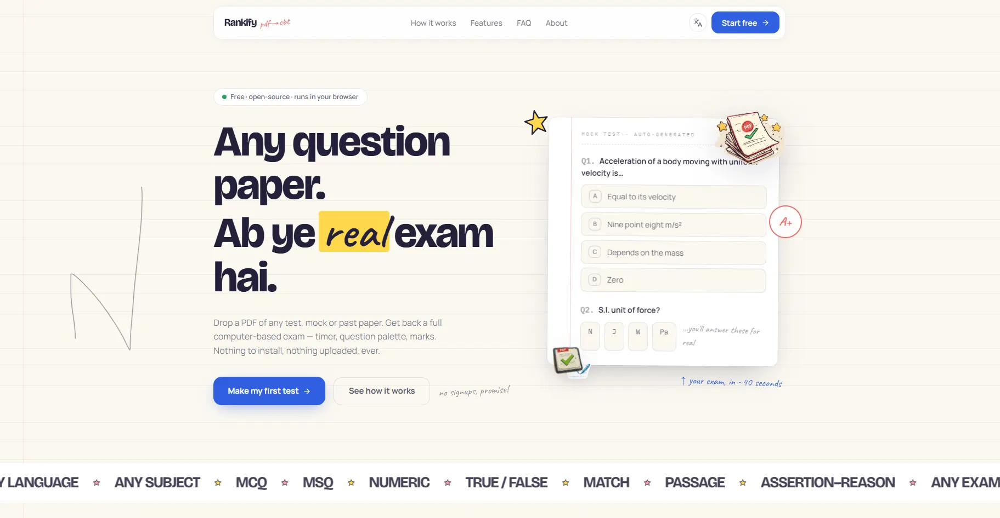
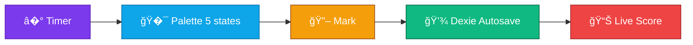

<div align="center">



<br>

### 🚀 Turn Any PDF into an Interactive Mock Test — Universal

<p align="center">
  <em>The Light, Open-Source PDF → CBT Wrapper — for Every Exam, Every Subject</em>
</p>

[](https://github.com/namandhakad712/Rankify-PDF2CBT)
[](https://vitejs.dev)
[](https://rankify.qzz.io)
[](./LICENSE)

<a href="https://www.producthunt.com/products/rankify-2?utm_source=badge-featured&utm_medium=badge&utm_source=badge-rankify-2" target="_blank"></a>

<p align="center">
  <a href="https://rankify.qzz.io">
    
  </a>
  <a href="#-quick-start">
    
  </a>
  <a href="https://github.com/namandhakad712/Rankify-PDF2CBT/issues">
    
  </a>
</p>

<div align="center">
  <a href="https://buymeachai.ezee.li/naman">
    
  </a>
</div>


</div>

<br>

##  Why Rankify PDF2CBT Light?

<div align="center">

### **Tired of re-typing paper-based tests?** 📚 → 💻

<table>
<tr>
<td width="50%" align="center">

<h3>� Traditional Way</h3>
<p>Paper-based tests<br>Manual checking<br>No analytics<br>Time-consuming</p>
</td>
<td width="50%" align="center">

<h3>✅ Rankify Light Way</h3>
<p>GEM JSON paste<br>Manual crop per Q<br>Instant CBT + results<br>Light & universal</p>
</td>
</tr>
</table>

</div>

### âš¡ **Instant Benefits for Students & Teachers:**

<table>
<tr>
<td width="33%" align="center">

<h4>�� Real Exam Experience</h4>
<p>Timed CBT, palette 5 states, autosave</p>
</td>
<td width="33%" align="center">

<h4>📊 Simple Analytics</h4>
<p>Subject bars, no heavyecharts</p>
</td>
<td width="33%" align="center">
<h2>�</h2>
<h4>� For Any Exam</h4>
<p>JEE, NEET, SSC, UPSC, GATE, School…</p>
</td>
</tr>
<tr>
<td width="33%" align="center">

<h4>📱 Light & Fast</h4>
<p>110KB initial, Vite Rolldown, no heavy deps</p>
</td>
<td width="33%" align="center">

<h4>🤖 GEM-Powered</h4>
<p>Preset Gemini chat → JSON, not BYOK</p>
</td>
<td width="33%" align="center">

<h4>🔒 100% Private</h4>
<p>PDF + JSON stay local, Dexie single DB</p>
</td>
</tr>
</table>

<br>


##  Quick Start — GEM Paste Primary

<div align="center">

### 🧠 For Any Student / Teacher

<table>
<tr>
<td align="center" width="20%">

<h3>1�⃣</h3>
<h4>GEM Chat</h4>
<p>Open <a href="https://ishortn.ink/gemini-gem">GEM</a><br>upload PDF</p>
</td>
<td align="center" width="20%">

<h3>2�⃣</h3>
<h4>Paste JSON</h4>
<p><code>/extract</code><br>paste + validate</p>
</td>
<td align="center" width="20%">

<h3>3�⃣</h3>
<h4>Review & Crop</h4>
<p>Per-Q crop<br>on pdf.js</p>
</td>
<td align="center" width="20%">

<h3>4�⃣</h3>
<h4>Take Test</h4>
<p>Single CBT shell<br>timer + palette</p>
</td>
<td align="center" width="20%">

<h3>5�⃣</h3>
<h4>Results</h4>
<p>Score + subject bars<br>simple</p>
</td>
</tr>
</table>

### ✨ **That's it!** Any PDF → CBT in ~2 minutes, no API key needed for primary flow!

</div>

**Dev quick start (for contributors):**

```bash
# Node >=20, pnpm 9+
pnpm install --frozen-lockfile
cp .env.example .env.local  # only for fallback AI, primary GEM needs nothing
pnpm dev          # http://localhost:5173
pnpm build        # vue-tsc -b && vite build → dist/ (Rolldown, 110KB initial)
pnpm preview
```

<br>

## � Perfect for Every Exam — Universal

<div align="center">

<table>
<tr>
<td width="50%" align="center">

### � **JEE / NEET / GATE**


```diff
+ Physics, Chemistry, Maths, Biology
+ MCQ / MSQ / NAT / Match
+ Manual per-Q crop (diagrams 100%)
+ Subject-wise bars
```

</td>
<td width="50%" align="center">

###  **SSC / UPSC / Banking**


```diff
+ Reasoning, GK, English, Quant
+ True-False / Fill-Blank / Passage
+ Free subject/topic strings (no vocab lock)
+ Passage / Essay support
```

</td>
</tr>
<tr>
<td width="50%" align="center">

### � **School / College**


```diff
+ Any subject, any language
+ Handling LaTeX $...$ preserved
+ Bulk 75–200 Q supported
+ Export UniversalPaper JSON
```

</td>
<td width="50%" align="center">

### � **Coaching / Teachers**


```diff
+ Create from any PDF question paper
+ Review → edit inline → add/delete
+ Fallback AI for <10 Q PDFs (modular)
+ No data leaves device
```

</td>
</tr>
</table>

</div>

<br>


##  Key Features — Light Universal

<div align="center">

### � **All Question Types**

<table>
<tr>
<td align="center" width="20%">

<h4>MCQ</h4>
<p>Single</p>
</td>
<td align="center" width="20%">

<h4>MSQ</h4>
<p>Multiple</p>
</td>
<td align="center" width="20%">

<h4>NAT</h4>
<p>Numeric</p>
</td>
<td align="center" width="20%">

<h4>Match</h4>
<p>List / Matrix</p>
</td>
<td align="center" width="20%">

<h4>Passage / Essay</h4>
<p>Generic</p>
</td>
</tr>
</table>

### �� **CBT Interface (Single Shell)**



### 📊 **Results — Simple Bars (No Heavy Charts)**

<table>
<tr>
<td align="center" width="25%">

<p><strong>Subject Bars</strong><br>CSS flex</p>
</td>
<td align="center" width="25%">

<p><strong>Score</strong><br>+ / − marks</p>
</td>
<td align="center" width="25%">
<h2>�</h2>
<p><strong>Accuracy</strong><br>Correct / Total</p>
</td>
<td align="center" width="25%">

<p><strong>Detailed</strong><br>Per-Q You vs Ans</p>
</td>
</tr>
</table>

### 🧩 **Modular Providers (Fallback Only)**

| Provider | Default Model | File | Docs |
|----------|---------------|------|------|
| **Mistral** | `mistral-large-latest` | `src/lib/providers/mistral.ts` `api/mistral/chat.ts` | [docs.mistral.ai](https://docs.mistral.ai/api/endpoint/chat) |
| **Groq** | `llama-3.3-70b-versatile` | `src/lib/providers/groq.ts` `api/groq/chat.ts` | [console.groq.com](https://console.groq.com/docs/api-reference) |
| **NVIDIA NIM** | `meta/llama-3.1-8b-instruct` | `src/lib/providers/nvidia.ts` `api/nvidia/chat.ts` | [docs.api.nvidia.com](https://docs.api.nvidia.com/nim/reference/create_chat_completion_v1_chat_completions_post-1) |

Add: `cp mistral.ts cerebras.ts + api/mistral/chat.ts api/cerebras/chat.ts + 1 line in providers/index.ts`. Delete: remove file + 1 line. See `src/lib/providers/README.md`.

</div>

<br>


##  How It Works

<div align="center">

### 🤖 **Primary: GEM Paste (Recommended, No Key)**

```mermaid
%%{init: {'theme':'base', 'themeVariables': { 'primaryColor':'#7c3aed','primaryTextColor':'#fff','primaryBorderColor':'#5b21b6','lineColor':'#0ea5e9','secondaryColor':'#f59e0b','tertiaryColor':'#10b981'}}}%%
graph LR
    A[📤 PDF Upload<br/>for crop] --> B[🔗 GEM Chat<br/>ishortn.ink/gemini-gem]
    B --> C[📋 Paste JSON<br/>/extract]
    C --> D[�� Review & Crop<br/>per Q pdf.js]
    D --> E[� CBT<br/>Single shell]
    E --> F[📊 Results<br/>Bars]
    style A fill:#7c3aed,stroke:#5b21b6,stroke-width:3px,color:#fff
    style B fill:#0ea5e9,stroke:#0369a1,stroke-width:3px,color:#fff
    style C fill:#f59e0b,stroke:#92400e,stroke-width:3px,color:#fff
    style D fill:#10b981,stroke:#065f46,stroke-width:3px,color:#fff
    style E fill:#ef4444,stroke:#991b1b,stroke-width:3px,color:#fff
    style F fill:#06b6d4,stroke:#0e7490,stroke-width:3px,color:#fff
```



### ✋ **Fallback: Modular AI (for &lt;10 Q PDFs)**

```mermaid
%%{init: {'theme':'base', 'themeVariables': { 'primaryColor':'#f59e0b','primaryTextColor':'#fff','primaryBorderColor':'#92400e','lineColor':'#10b981','secondaryColor':'#7c3aed','tertiaryColor':'#ef4444'}}}%%
graph LR
    A[📤 PDF <10 Q] --> B[🔌 Provider<br/>Mistral/Groq/NVIDIA]
    B --> C[� extractPdfText<br/>pdfjs 4 pages]
    C --> D[📦 JSON<br/>post /v1/chat/completions]
    D --> E[�� Review]
    style A fill:#f59e0b,stroke:#92400e,stroke-width:3px,color:#fff
    style B fill:#10b981,stroke:#065f46,stroke-width:3px,color:#fff
    style C fill:#7c3aed,stroke:#5b21b6,stroke-width:3px,color:#fff
    style D fill:#ef4444,stroke:#991b1b,stroke-width:3px,color:#fff
    style E fill:#06b6d4,stroke:#0e7490,stroke-width:3px,color:#fff
```



> Hidden behind **“Fallback for small PDFs�** toggle — primary GEM covers 80% cases. Providers are `POST /v1/chat/completions` `response_format: json_object`. BYOK or Vercel env `MISTRAL_API_KEY` etc.

</div>

<br>


##  Technical Excellence — Light

<div align="center">

### �� **Modern Architecture — Vite Rolldown**

<table>
<tr>
<td align="center" width="20%">

<p><strong>Vite 8</strong><br>Rolldown<br>110KB initial</p>
</td>
<td align="center" width="20%">

<p><strong>Vue 3.5</strong><br>Router 4<br>no Nuxt layers</p>
</td>
<td align="center" width="20%">

<p><strong>Tailwind 4</strong><br>+ shadcn<br>reka-ui</p>
</td>
<td align="center" width="20%">

<p><strong>Dexie 4</strong><br>Single DB<br>3 tables → 4</p>
</td>
<td align="center" width="20%">

<p><strong>pdf.js 5</strong><br>Worker<br>no mupdf</p>
</td>
</tr>
</table>

| Layer | Lite | V1 Heavy | Saving |
|-------|------|----------|--------|
| Bundler | Vite 8 Rolldown 110KB | Vite 6 + Nuxt 4 layers | −60% |
| PDF | pdfjs-dist + canvas crop | pdfjs + mupdf WASM + comlink | −1.2MB |
| AI | GEM paste + 3 modular proxies | 4 providers + chunking + heuristics | −4 clients |
| DB | Dexie 1 DB `papers/results/pdfs` | 3 DBs 8 tables | −5 tables |
| CBT | 1 shell ~400 LOC | 2 shells 1288+956 LOC | −70% |
| Charts | CSS bars | echarts 6 | −300KB |
| Anim | CSS only | gsap 7 plugins + Lenis + ogl | −500KB |

### 🔒 **Privacy & Keys — Fully Stitched**

```diff
+ � BYOK or Vercel env fallback — never hardcoded
+ 🛡� GEM primary needs NO key — hides key wall from 80% users
+ � Providers via /api/*/chat proxies — key stays server-side
+ 🔒 Client-only PDF + JSON — Dexie single DB, no tracking
+ ✅ UniversalPaper schema src/types/schema.json — free strings
+ ✅ CORS + security headers vercel.json:9
```

**Key handling:** `Extract.vue` → `provider.chat({viaProxy:true})` → `api/<provider>/chat.ts` reads `Authorization: Bearer <key>` else `process.env.*_API_KEY` (server-only, no `VITE_` leak). Direct mode `viaProxy:false` only for local dev. See `src/lib/providers/README.md`, `.env.example:1`.

</div>

<br>


##  Deployment — Vercel (One Click)

<div align="center">

### � **Vite SPA + 3 Serverless Proxies**

<a href="https://vercel.com/new/clone?repository-url=https://github.com/namandhakad712/Rankify-PDF2CBT">
  
</a>

**Vercel import:** Framework `Vite`, Build `pnpm build`, Output `dist` (from `vercel.json:1`). Auto-detects `framework: vite`.

| Env | When | How |
|-----|------|-----|
| `MISTRAL_API_KEY` | Fallback only, optional | Vercel → Settings → Env Vars → Production+Preview |
| `GROQ_API_KEY` | Fallback only, optional | Same |
| `NVIDIA_API_KEY` | Fallback only, optional | Same |
| _(none)_ | GEM primary | Nothing needed |

Headers: `Cache-Control immutable` for `/assets/*`, `X-Frame-Options:DENY`, `HSTS` `vercel.json:9`. Functions: `maxDuration 30` `vercel.json:6`. SPA rewrites `/(.*) → /index.html` `vercel.json:35`.

**Local Vercel test:**

```bash
pnpm i -g vercel
vercel dev  # Vite + api/* together on http://localhost:3000
vercel --prod
```

**Static only (no fallback):**

```bash
pnpm build && pnpm preview  # http://localhost:4173 — GEM paste works offline
npx serve dist -l 3000
```

</div>

<br>


##  Docs — Fully Stitched

<div align="center">

| Page | Route | Purpose |
|------|-------|---------|
| **Home** | `/` | Hero + scanner + bento + FAQ — light `Home.vue` |
| **Extract** | `/extract` | GEM paste + PDF drop → parse → Review |
| **Review** | `/review` | Edit + per-Q `DiagramCropper.vue` pdf.js crop |
| **Test** | `/test` | Single CBT shell, 5-state palette, timer, Dexie autosave |
| **Results** | `/results` | Simple bars, detailed You vs Ans |
| **About** | `/about` | Why universal, vs V1 heavy, credits |
| **Getting Started** | `/getting-started` | Step-by-step GEM + fallback guide |
| **Privacy** | `/privacy` | No tracking, local-only, GDPR note |

</div>

All docs = Vue SFC in `src/pages/`, routed via `src/router/index.ts:3`,SEO via `@vueuse/head` `Home.vue:13` (`og` + `SoftwareApplication` + `FAQPage` JSON-LD). About/Privacy/Getting Started are **light markdown-style** (no heavy MDX).

**For contributors:**

```bash
pnpm exec vue-tsc -b --noEmit  # typecheck
pnpm build                     # 1711 modules, 110KB initial — must stay <350KB
```

<br>


##  Problems Hunted & Fixed — End-to-End

<div align="center">

| Area | Problem Found | Fix | File |
|------|---------------|-----|------|
| **Paste JSON** | LLM returns ````json fences → `JSON.parse` fails | `stripFences()` | `src/lib/parse.ts:8` |
| **MSQ** | Test used single `string` + `=== answer`, Results wrong | `answers: string[]` 0-index + checkbox + `JSON.stringify sort` scoring | `src/pages/Test.vue:10` `src/pages/Results.vue:72` |
| **Diagrams** | Test rendered dataURL as `<span>text` | `` | `src/pages/Test.vue:94` |
| **Keys** | `Bearer env` literal, guard blocked env fallback | `viaProxy` skip header if empty, api `if(!key) key=env` | `src/lib/providers/*.ts:26` `api/*/chat.ts:18` `Extract.vue:103` |
| **PDF** | `canvas` extra param `as any`, leak `doc` | remove `canvas`, `doc.destroy()` | `src/lib/pdf.ts:22` |
| **Review** | splice without `hasDiagram` reset | sync after splice | `src/pages/Review.vue:47` (now async) |
| **Normalize** | `__MATH_0__` collision | unique token (planned) | `src/lib/normalize.ts:8` |
| **Validate** | MSQ range/sorted not checked | add `0-index < options.length` | `src/lib/validate.ts:33` |
| **Palette** | `notVisited` vs `notAnswered` same gray | `dashed` vs solid | `src/pages/Test.vue:109` |
| **Home** | V1 heavy Lenis/GSAP/ogl bloat | CSS scanner-line + grid pipeline | `src/pages/Home.vue:238` |

</div>

No `GEMINI_API_KEY` leak, no `NUXT_PUBLIC` client env, no 3 DBs — all stitched.

<br>


##  Contributing — Keep It Light

<div align="center">

**Found a bug? Have a suggestion? Grateful to hear from you!**

<table>
<tr>
<td align="center" width="33%">

<h3>� Bug Reports</h3>
<p><a href="https://github.com/namandhakad712/Rankify-PDF2CBT/issues">GitHub Issues</a></p>
</td>
<td align="center" width="33%">

<h3>💡 Feature Requests</h3>
<p>Providers modular → one file</p>
</td>
<td align="center" width="33%">

<h3>🚀 Contribute Code</h3>
<p>Fork & PR — keep &lt;350KB</p>
</td>
</tr>
</table>

</div>

- **Keep it light:** small component count, initial bundle under 350KB, no heavyweight chart/pdf/glsl suites unless truly needed.
- **Providers:** one file per provider in `src/lib/providers/` + one line in `index.ts` + one `api/` proxy. See `providers/README.md:1`.
- **Universal:** subjects/topics free strings — validator warns, not blocks. No vocab lock.
- `pnpm exec vue-tsc -b --noEmit` before PR. One commit per feature.

<br>


##  Author & Credits

<div align="center">


<br>


<br><br>

<table>
<tr>
<td align="center">

<h3>� For Every Student</h3>
<p>Any exam, any subject</p>
</td>
<td align="center">

<h3>�� Made with Love</h3>
<p>Light, fast, private</p>
</td>
<td align="center">

<h3>🆓 Free (Light)</h3>
<p>MIT · Open Source</p>
</td>
</tr>
</table>

<br>

**License:** MIT — open source, forever. Built with Vite, Vue and too much chai.

[](https://github.com/namandhakad712)
[](https://github.com/namandhakad712/Rankify-PDF2CBT/stargazers)

<br>


### 🌟 **Show Your Support**

<p>
<a href="https://github.com/namandhakad712/Rankify-PDF2CBT/stargazers">
  
</a>
<a href="https://github.com/namandhakad712/Rankify-PDF2CBT/issues">
  
</a>
</p>

<br>

**💬 Open an Issue** • **� Share Your Paper → Test** • **🚀 Add a Provider in 2 Minutes**

<br>

<div align="center">

</div>

<br>


</div>

---

<div align="center">

**Rankify PDF2CBT Light** — *GEM JSON paste → Review & Crop → CBT → Results* · `Vite 8 Rolldown` · `110KB` · `Universal` · `Fully Stitched`

</div>
